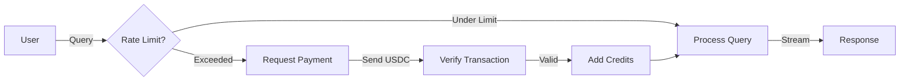

# RAG Chatbot Quick Reference

One-page reference for the OpenLibx402 RAG Chatbot.

## 🚀 Quick Start

```bash
# 1. Clone and navigate
cd chatbot

# 2. Set environment variables
cp .env.example .env
# Edit .env with your API keys

# 3. Run locally
deno task dev

# 4. Open browser
open http://localhost:8000
```

## 📦 Tech Stack

| Component | Technology |
|-----------|-----------|
| Runtime | Deno 2.x |
| Framework | Hono |
| Database | Pinecone (vector) + Deno KV (state) |
| LLM | OpenAI GPT-4o-mini |
| Embeddings | text-embedding-3-small |
| Payments | Solana (USDC on mainnet) |
| Deployment | Deno Deploy |

## 🔑 Environment Variables

```bash
# Required
OPENAI_API_KEY=sk-proj-...
PINECONE_API_KEY=pcsk_...
PINECONE_INDEX_NAME=openlibx402-docs

# Solana Payments
SOLANA_RPC_URL=https://api.mainnet-beta.solana.com
PAYMENT_WALLET_ADDRESS=your-solana-wallet
USDC_MINT_ADDRESS=EPjFWdd5AufqSSqeM2qN1xzybapC8G4wEGGkZwyTDt1v
USDC_DECIMALS=6

# Optional
RATE_LIMIT_FREE_QUERIES=3
RATE_LIMIT_WINDOW_HOURS=24
PAYMENT_AMOUNT_USDC=0.1
```

## 📡 API Endpoints

### GET `/api/query`

Stream RAG-powered responses (SSE).

**Query Parameters:**
- `q` - User question (required)
- `clientId` - Client identifier (optional)

**Response:** Server-Sent Events stream

```bash
curl "http://localhost:8000/api/query?q=How%20to%20install%20OpenLibx402"
```

**SSE Events:**
- `data: [DONE]` - Stream complete
- `data: {"error": "..."}` - Error occurred
- `data: <chunk>` - Response chunk

### POST `/api/check-rate-limit`

Check if client has free queries remaining.

**Body:**
```json
{
  "clientId": "unique-client-id"
}
```

**Response:**
```json
{
  "allowed": true,
  "remaining": 2,
  "resetAt": "2025-11-11T00:00:00Z"
}
```

### POST `/api/verify-payment`

Verify USDC payment transaction.

**Body:**
```json
{
  "signature": "tx-signature-hash",
  "clientId": "unique-client-id"
}
```

**Response:**
```json
{
  "success": true,
  "queriesAdded": 10
}
```

### GET `/api/health`

Health check endpoint.

**Response:**
```json
{
  "status": "ok",
  "timestamp": "2025-11-10T..."
}
```

## 💰 Payment Flow



**Payment Details:**
- **Amount:** 0.1 USDC
- **Network:** Solana Mainnet
- **Token:** USDC (SPL Token)
- **Credits:** 10 queries per payment

## 🔒 Rate Limiting

| Plan | Queries | Window | Cost |
|------|---------|--------|------|
| Free | 3 queries | 24 hours | Free |
| Paid | 10 queries | Per payment | 0.1 USDC |

**Rate Limit Storage:** Deno KV

```typescript
// Key format
const key = ["rate_limit", clientId];

// Value
{
  count: number;
  resetAt: Date;
  paidQueries: number;
}
```

## 🧠 RAG Pipeline

1. **User Query** → Embedding generation
2. **Vector Search** → Pinecone (top 5, score > 0.7)
3. **Context Formatting** → Concatenate results
4. **LLM Generation** → GPT-4o-mini with context
5. **Streaming Response** → SSE to client

**Configuration:**
```typescript
{
  topK: 5,
  minScore: 0.7,
  model: 'gpt-4o-mini',
  temperature: 0.7,
  maxTokens: 1000
}
```

## 📝 Common Tasks

### Index New Documentation

```bash
# Run indexing script
deno task index

# Or manually
deno run --allow-all scripts/index-docs.ts
```

### Check Pinecone Index

```typescript
import { Pinecone } from '@pinecone-database/pinecone';

const pc = new Pinecone({ apiKey: process.env.PINECONE_API_KEY });
const index = pc.index('openlibx402-docs');
const stats = await index.describeIndexStats();

console.log(`Vectors: ${stats.totalRecordCount}`);
```

### Test Payment Verification

```bash
# Test transaction
curl -X POST http://localhost:8000/api/verify-payment \
  -H "Content-Type: application/json" \
  -d '{
    "signature": "test-tx-hash",
    "clientId": "test-client"
  }'
```

### Monitor Rate Limits

```typescript
// Check all rate limits in Deno KV
const kv = await Deno.openKv();
const iter = kv.list({ prefix: ["rate_limit"] });

for await (const entry of iter) {
  console.log(entry.key, entry.value);
}
```

## 🚢 Deployment

### Local Development

```bash
deno task dev
```

### Production (Deno Deploy)

```bash
# Install deployctl
deno install -A -r -f --global \
  https://deno.land/x/deploy/deployctl.ts

# Deploy
./deploy.sh

# Or manually
deployctl deploy \
  --project=openlibx402-chatbot \
  --prod \
  src/index.ts
```

### Environment Setup

1. **Deno Deploy Dashboard** → Project Settings → Environment Variables
2. Add all required variables
3. Deploy with `deploy.sh`

## 🛠️ Troubleshooting

### Issue: "Rate limit exceeded"

**Solution:**
```bash
# Reset rate limit for client
deno eval "
const kv = await Deno.openKv();
await kv.delete(['rate_limit', 'CLIENT_ID']);
"
```

### Issue: "Pinecone connection failed"

**Checks:**
1. Verify `PINECONE_API_KEY`
2. Check `PINECONE_INDEX_NAME` exists
3. Ensure index has correct dimensions (1536)

### Issue: "Payment verification failed"

**Checks:**
1. Verify `SOLANA_RPC_URL` is accessible
2. Check `PAYMENT_WALLET_ADDRESS` is correct
3. Ensure transaction is confirmed on-chain
4. Verify USDC mint address matches mainnet

### Issue: "OpenAI API errors"

**Solutions:**
- Check `OPENAI_API_KEY` validity
- Verify quota/billing
- Check rate limits
- Reduce `maxTokens` if hitting context limits

## 📊 Monitoring

### Key Metrics

```typescript
// Log key metrics
{
  queryCount: number;
  avgResponseTime: number;
  cacheHitRate: number;
  paymentSuccess: number;
  errors: {
    openai: number;
    pinecone: number;
    solana: number;
  }
}
```

### Logs

```bash
# View deployment logs
deployctl logs --project openlibx402-chatbot

# Filter errors
deployctl logs --project openlibx402-chatbot | grep ERROR
```

## 🔗 Related Documentation

- [Full Quickstart Guide](quickstart.md) - Detailed setup instructions
- [Architecture](architecture.md) - System design details
- [API Reference](api.md) - Complete API documentation
- [Payment System](payments.md) - USDC payment details
- [Deployment Guide](deployment.md) - Production deployment
- [Configuration](configuration.md) - Environment setup

## 💡 Tips & Best Practices

1. **Rate Limiting:** Use `clientId` consistently for accurate tracking
2. **Payments:** Always verify transactions on-chain before adding credits
3. **Context Length:** Monitor token usage to avoid OpenAI limits
4. **Vector Search:** Adjust `minScore` (0.7-0.85) based on precision needs
5. **Caching:** Consider caching frequent queries to reduce costs
6. **Monitoring:** Set up alerts for API failures and rate limit exhaustion

## 📞 Support

- **Issues:** [GitHub Issues](https://github.com/openlibx402/openlibx402/issues)
- **Discord:** Coming soon
- **Email:** x402@openlib.xyz

---

**Quick Links:** [Overview](overview.md) | [API Docs](api.md) | [Deploy](deployment.md)
